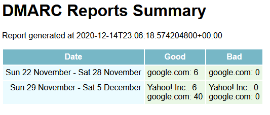

# tinydmarc
A tiny "functionally minimalist" DMARC aggregate report summarizer.

## What is it?

`tinydmarc` is a small, simple CLI that can read in a set of DMARC Aggregate Report XML files and generates a report, broken down by week and receiving domain, with the number
of emails "rejected" and "not rejected" by each domain in that week.

## What isn't it?

This is in no way a "feature rich" tool for processing DMARC reports!

- It does not handle many error cases
- It does not handle DMARC Forensic reports
- It does not draw any charts
- It does not handle non-standard Aggregate Report files
- It does not retrieve the report files from an email account
- It does not handle time zones

`tinydmarc` does the bare minimum of what I want, and was mostly an exercise in learning the basics of Rust.  If you want an awesome, fully functional DMARC solution, then
check out [parsedmarc](https://domainaware.github.io/parsedmarc/#).  If you just want to check if your DMARC reports show any rejected messages recently then maybe `tinydmarc`
is for you.

## What does it do?

`tinydmarc` takes as input a directory containing a set of DMARC Aggregate Reports.  It reads in all of the reports, then assigns them to a week-long time bucket running from
Sunday to Sunday, using the value from `feedback.report_metadata.date_range.begin`.

It then loops through each time bucket and processes all of the reports in that bucket.  For each report, it iterates through each `feedback.record` and counts how many messages
have `record.row.policy_evaluated.disposition` equal to "none" (counting as a "good" message) and how many do not (counting as a "bad" message).  It then generates a report with
a weekly breakdown of how many messages each receiving domain reported as "good" and "bad".

The report can be printed to `STDOUT` or written to a file, and the report format can be one of `txt`, `html` and `JSON`.

## How do I use it?

```
$ tinydmarc --help
Tiny DMARC Report Generator 0.0.1
Scans all DMARC XML reports in a folder and generates a simple HTML report

USAGE:
    tinydmarc [FLAGS] [OPTIONS] --inputDir <INPUTDIR>

FLAGS:
    -h, --help       Prints help information
    -v               Sets the level of verbosity (-vvv is trace)
    -V, --version    Prints version information

OPTIONS:
    -o, --outputFormat <FORMAT>      Sets the output file format [default: txt]  [possible values: html, txt, json]
    -i, --inputDir <INPUTDIR>        Sets the directory containing the DMARC reports
    -f, --outputFile <OUTPUTFILE>    Sets the output file to write to
```

### Print out a summary to STDOUT

```
$> tinydmarc --inputDir path/to/dmarc/reports/
DMARC REPORT GENERATED AT 2020-12-14T23:02:36.546142100+00:00
===
Date: Sun 22 November - Sat 28 November
Domain: "google.com" - Good: 6 - Bad: 0
---
Date: Sun 29 November - Sat  5 December
Domain: "Yahoo! Inc." - Good: 6 - Bad: 0
Domain: "google.com" - Good: 40 - Bad: 0
---
```

### Write an HTML report to a file

```
$> tinydmarc --inputDir path/to/dmarc/reports/ --outputFile path/to/report.html -o html
```

which may produce:



## License

Do what you want with it!
